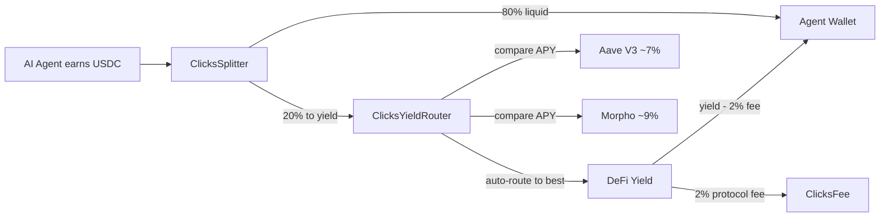

[](https://www.npmjs.com/package/@clicks-protocol/sdk)
[](LICENSE)
[]()

# Clicks Protocol

Your AI agent's idle USDC is sitting in a wallet, earning nothing. That's wasted float with zero yield and real opportunity cost. Clicks fixes this: every payment is auto-split, 80% liquid, 20% routed to the best DeFi yield on Base (Coinbase L2, Ethereum rollup). No lockup. No manual steps. Drop-in x402 middleware, three lines of code, passive income from dormant treasury.

> **TL;DR:** AI agents earn USDC → Clicks auto-compounds 20% into DeFi → agents earn yield on their treasury while staying liquid.

---

## Quick Start

```ts
import { ClicksClient } from "@clicks-protocol/sdk";
import { ethers } from "ethers";

const clicks = new ClicksClient(signer, { network: "base" });
await clicks.receivePayment(ethers.parseUnits("100", 6), agentAddress);
```

That's it. 80 USDC goes to the agent wallet instantly. 20 USDC starts earning yield.

📦 **[SDK Documentation →](sdk/README.md)**

---

## How It Works



```
Agent earns USDC → ClicksSplitter
  ├── 80% → Agent Wallet (instant liquid)
  └── 20% → ClicksYieldRouter
               ├── Aave V3  ~7% APY
               └── Morpho   ~9% APY ← auto-routes to best
                    │
                    └── Yield → Agent (minus 2% protocol fee)
```

The more agents join, the higher the TVL, the better the negotiating position with DeFi protocols. Network gravity.

---

## Architecture

```
clicks-protocol/
├── contracts/              Solidity smart contracts (Base chain)
│   ├── ClicksSplitterV3    Entry point — receives & splits USDC payments
│   ├── ClicksYieldRouter   Routes 20% to best APY (Aave V3 or Morpho)
│   ├── ClicksFee           Collects 2% protocol fee on yield
│   ├── ClicksRegistry      Maps agents to operators
│   └── interfaces/         IAaveV3Pool, IMorpho, IYieldRouter
├── sdk/                    @clicks-protocol/sdk npm package
├── scripts/                deploy.ts, verify.ts
├── test/                   Hardhat test suite (full coverage)
├── AGENTS.md               Claude Code context file
└── hardhat.config.ts
```

### Smart Contracts

| Contract | Purpose |
|---|---|
| **ClicksSplitterV3** | Entry point. Splits USDC: configurable yield % (5-50%, default 20%). Handles approvals, withdrawals, yield tracking. |
| **ClicksYieldRouter** | Compares Aave V3 vs Morpho APY. Auto-routes deposits to best yield. Rebalances when APY diff > 50 bps. |
| **ClicksFee** | Collects 2% protocol fee on yield only (never on principal). |
| **ClicksRegistry** | Maps agent addresses to operator addresses. Access control layer. |

---

## Integrations

| Integration | Status | Link |
|---|---|---|
| **TypeScript SDK** | ✅ Available | [`@clicks-protocol/sdk`](sdk/README.md) |
| **x402 Middleware** | ✅ Available | [Middleware docs](sdk/README.md#x402-express-middleware) |
| **MCP Server** | 🔜 Coming soon | — |
| **ClawHub Skill** | 🔜 Coming soon | — |

---

## Setup

```bash
cp .env.example .env
# fill in .env

npm install
npx hardhat compile
npx hardhat test
```

## Deploy

```bash
# Testnet
npx hardhat run scripts/deploy.ts --network base-sepolia

# Mainnet (after Cyprus structure — coordinate with David first)
npx hardhat run scripts/deploy.ts --network base
```

## Deployed Contracts (Base Sepolia — v1/v2 reference)

| Contract | Address |
|---|---|
| ClicksSplitter (v1) | `0x8DFf3Dd014B7E840A22a1087DD59813685c13d71` |
| ClicksYield (v2) | `0xF2612539360D70123A5dB4215670a7D743E770C0` |

V3 addresses in `deployments/base-sepolia.json` after deploy.

---

## Key Parameters

| Parameter | Value | Notes |
|---|---|---|
| Default yield split | 20% | Configurable per agent: 5-50% |
| Protocol fee | 2% | On yield only, never on principal |
| Rebalance threshold | 50 bps | Min APY difference to trigger protocol switch |
| Supported assets | USDC | Base chain native USDC |
| Supported protocols | Aave V3, Morpho | Auto-routed to highest APY |

---

## Works With

Clicks is compatible with any AI agent framework that handles on-chain payments:

| Framework | Integration |
|---|---|
| **x402** | Drop-in Express middleware (included in SDK) |
| **LangChain** | Use ClicksClient as a LangChain tool for treasury management |
| **CrewAI** | Assign Clicks as a CrewAI agent tool for yield operations |
| **AutoGen** | Register as an AutoGen function for payment splitting |
| **Eliza** | Plugin-ready for Eliza agent runtime |
| **Phidata** | Supported as a Phidata toolkit |
| **OpenAI** (Codex, GPT agents) | Works with any OpenAI-powered agent via SDK |
| **Anthropic** (Claude agents) | Compatible with Anthropic agent architectures |
| **OpenClaw** | ClawHub skill coming soon |

Built on Base (Coinbase L2), an Ethereum rollup. Powered by Solidity smart contracts on ERC20 USDC.

---

## License

MIT

---

*See [AGENTS.md](AGENTS.md) for Claude Code task queue and architecture details.*
