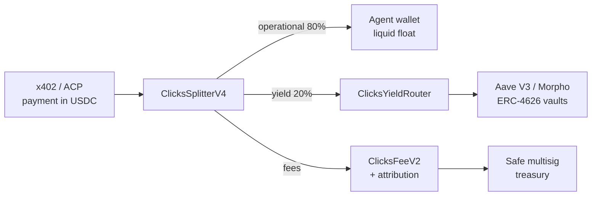

# Clicks Protocol

**The settlement layer when AI agents pay each other.**

Live on Base. USDC-native. Verifiable on-chain (ERC-8004 agentId `45074`).

*1-Pager · Stand 2026-04-22*

---

## The Problem

19 % of on-chain activity is now AI-agent-driven (DWF Ventures, April 2026). **100 % of their USDC sits idle by default.**

- Agents earn USDC from x402 micro-payments, ACP jobs, swap fees
- That USDC stays liquid in agent wallets between actions
- No layer today automatically splits operational float from productive yield
- Every agent-builder re-implements the same plumbing: fee split, attribution, idle-USDC-to-vault

**Clicks is that missing layer.** We don't operate vaults. We route flow.

---

## What Clicks Does (in one flow)



One contract call. Deterministic split. Everything on-chain, every party attributable.

---

## Live Components (Base Mainnet, Safe-owned)

| Component | Role |
|-----------|------|
| ClicksRegistry | Agent + merchant registry |
| **ClicksSplitterV4** | Multi-party deterministic USDC split, one call |
| ClicksYieldRouter | ERC-4626 yield allocation (Aave V3, Morpho vaults) |
| ClicksFeeV2 | Fee capture + treasury accounting |
| ClicksReferral | On-chain attribution layer (no MLM, no token) |

Safe multisig governance · 227/227 tests green · Apache-2.0 · Contracts shared on request after first call.

---

## Verifiable Trust Signals

- **ERC-8004 Trustless Agent:** `agentId 45074` on Base
- **Schema-V1 Attestation:** on-chain, Block 44836647
- **Identity manifest:** clicksprotocol.xyz/.well-known/agent-registration.json
- **Reputation Registry:** ERC-8004 standard registry (Base)
- **227/227 tests** green, Apache-2.0

No whitepaper-only promises. Everything above is deployed and verifiable on Basescan — full addresses shared after the first call.

---

## What Clicks is NOT

- **Not a vault operator** — we route into 3rd-party ERC-4626, we don't generate yield ourselves
- **Not a stablecoin issuer** — no cUSDC, no wrapped asset
- **Not a governance-token issuance play** — no token plans
- **Not multi-chain today** — Base-only until product-market-fit
- **Not a referral program** — on-chain attribution, no MLM

The smaller we stay, the more composable we are.

---

## Integration Surfaces

**For agent builders / yield agents / payment protocols:**

- **SDK:** `@clicks-protocol/sdk` (npm, 0.2.0) — TypeScript, wallet-agnostic
- **MCP server:** `@clicks-protocol/mcp-server` — Claude / Cursor / OpenClaw native
- **Framework plugins:** Eliza (0.2.0), LangChain (PyPI 0.2.0), CrewAI (PyPI 0.1.1)
- **Agent-treasury** (0.1.0) — opinionated default 80/20 split
- **Direct Solidity:** import `ClicksSplitterV4.sol`, call `splitAndRoute(…)`

```ts
import { ClicksClient } from "@clicks-protocol/sdk";
const clicks = new ClicksClient({ chain: "base", signer });
await clicks.splitAndRoute({ amountUsdc, ops: 0.8, yield: 0.2 });
```

Drop-in. One call site.

---

## Typical Partnership Shapes

| Partner type | Clicks role | Partner keeps |
|--------------|-------------|---------------|
| **Payment protocol (x402/ACP)** | Default settlement router for incoming USDC | Payment UX, merchant relationships |
| **Yield agent** (Aave/Morpho autopilot) | White-label execution of the yield leg | Strategy IP, risk model, front-end |
| **Agent framework / wallet** | Fee-split + attribution primitive | Distribution, UX, agent identity |
| **Data / research API** | x402-settled billing rail | Data, brand, IP |

Three proposal bundles per target in [`marketing/drafts/outreach/partner-map-2026-04-22.md`](../../outreach/partner-map-2026-04-22.md).

---

## Why Now

- Coinbase Agentic Wallets, Virtuals ACP, x402: the payment layer shipped in Q1 2026
- 16 Yield Agents on Cambrian's Landscape competing on strategy; none of them own the settlement plumbing
- Base-native USDC volume doubling quarter-over-quarter
- Circle T-bill spread + Aave/Morpho base rates = 4–7 % annualized on idle float that today earns 0

The window to become default infra is 2026, not 2027.

---

## Contact & Next Step

- **Lead:** David Bairaktaridis — david@clicksprotocol.xyz
- **GitHub:** https://github.com/clicks-protocol/clicks-protocol
- **Landing:** https://clicksprotocol.xyz
- **Dev.to thesis:** [19 % of on-chain activity is AI agents — 100 % of their USDC is idle by default](https://dev.to/clicksprotocol/19-of-on-chain-activity-is-ai-agents-and-100-of-their-usdc-is-idle-by-default-2l2j)

**Three integration calls away from earning yield on your agents' idle USDC. Let's scope it.**

---

<!-- _class: small -->

*Advisor-drafted artifact. Sending / publishing is a separate authorized action per Hard Rule #6 (CLAUDE.md). Contract addresses intentionally omitted from this 1-pager — shared via Evidence block in follow-up email after first call. V5 + ReputationMultiplier are prototypes, explicitly not included.*
