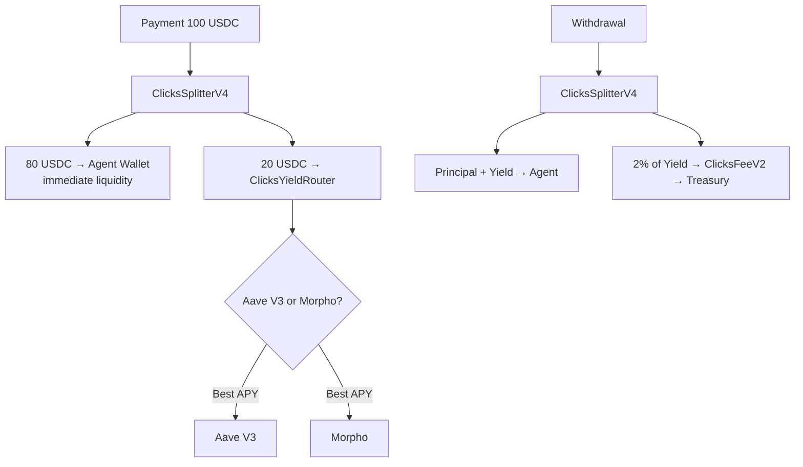

# @clicks-protocol/sdk

   

**Your AI agent's idle USDC earns 0% yield. Change that with one SDK call.**

Clicks Protocol: autonomous yield for AI agents on Base. 80% liquid, 20% earning. No lockup.

## Overview

Clicks Protocol automatically splits AI agent payments into:

**Works With:** AI agents using Claude, Cursor, Codex, LangChain, OpenAI, x402, and any MCP-compatible client.
- **Liquid portion** → agent wallet immediately
- **Yield portion** → best DeFi yield (Aave V3 or Morpho on Base)

The protocol takes a 2% fee on yield earned (not on principal).

## Installation

```bash
npm install @clicks-protocol/sdk
```

## Quick Start

```typescript
import { ClicksClient } from '@clicks-protocol/sdk';
import { ethers } from 'ethers';

// Connect to Base Mainnet
const provider = new ethers.JsonRpcProvider('https://mainnet.base.org');
const signer = new ethers.Wallet(process.env.PRIVATE_KEY!, provider);

const clicks = new ClicksClient(signer);

// 1. Register your AI agent
const regTx = await clicks.registerAgent('0xYourAgentAddress');
await regTx.wait();

// 2. Approve USDC spending (one-time)
const approveTx = await clicks.approveUSDC('max');
await approveTx.wait();

// 3. Receive a payment (auto-splits 80/20 by default)
const payTx = await clicks.receivePayment('100', '0xYourAgentAddress');
await payTx.wait();
// → 80 USDC sent to agent wallet
// → 20 USDC deposited into DeFi yield

// 4. Later: withdraw yield + principal
const { tx } = await clicks.withdrawYield('0xYourAgentAddress');
await tx.wait();
```

## API Reference

### `new ClicksClient(signerOrProvider, options?)`

| Parameter | Type | Description |
|-----------|------|-------------|
| `signerOrProvider` | `Signer \| Provider` | ethers v6 Signer (write) or Provider (read-only) |
| `options.chainId` | `number` | Chain ID. Default: `8453` (Base Mainnet) |
| `options.addresses` | `Partial<ClicksAddresses>` | Override contract addresses |

### Write Methods (require Signer)

#### `registerAgent(agentAddress)`
Register an AI agent. The caller becomes the operator.

#### `deregisterAgent(agentAddress)`
Remove an agent. Only the operator or owner can call this.

#### `receivePayment(amount, agentAddress)`
Split a USDC payment. `amount` is human-readable (e.g. `"100"` = 100 USDC).

#### `withdrawYield(agentAddress, amount?)`
Withdraw yield + principal. Omit `amount` or pass `"0"` for full withdrawal.

#### `approveUSDC(amount)`
Approve the splitter to spend USDC. Pass `"max"` for unlimited.

#### `setOperatorYieldPct(pct)`
Set custom yield split (5–50%). Pass `0` to revert to default.

### Read Methods (work with Provider)

#### `simulateSplit(amount, agentAddress)` → `SplitPreview`
Preview how a payment would be split.

```typescript
const preview = await clicks.simulateSplit('1000', agentAddr);
console.log(`Liquid: ${preview.liquid}`);   // 800000000 (800 USDC)
console.log(`Yield:  ${preview.toYield}`);  // 200000000 (200 USDC)
console.log(`Split:  ${preview.yieldPct}%`); // 20
```

#### `getAgentInfo(agentAddress)` → `AgentInfo`
Get agent registration status, operator, deposited principal, yield percentage.

```typescript
const info = await clicks.getAgentInfo(agentAddr);
console.log(info.isRegistered); // true
console.log(info.operator);     // '0x...'
console.log(info.deposited);    // 200000000n (200 USDC in yield)
console.log(info.yieldPct);     // 20n
```

#### `getYieldPct(agentAddress)` → `bigint`
Get the effective yield percentage for an agent.

#### `getYieldInfo()` → `YieldInfo`
Get protocol-wide yield information (active protocol, APYs, balances).

#### `getFeeInfo()` → `FeeInfo`
Get protocol fee information (total collected, pending, treasury).

#### `getOperatorAgents(operatorAddress)` → `string[]`
List all agents registered under an operator.

#### `getAllowance(owner)` → `bigint`
Check USDC allowance for the splitter.

#### `getUSDCBalance(address)` → `bigint`
Check USDC balance of any address.

## Advanced Usage

### Direct Contract Access

```typescript
const clicks = new ClicksClient(signer);

// Access raw ethers Contract instances
const registry = clicks.registryContract;
const splitter = clicks.splitterContract;
const router = clicks.yieldRouterContract;
const fees = clicks.feeCollectorContract;
const usdc = clicks.usdcContract;

// Call any function directly
const totalAgents = await registry.totalAgents();
```

### Custom Addresses (Local Fork)

```typescript
const clicks = new ClicksClient(signer, {
  addresses: {
    splitter: '0xLocalForkSplitterAddress',
    registry: '0xLocalForkRegistryAddress',
  },
});
```

### Base Sepolia (Testnet)

```typescript
const clicks = new ClicksClient(signer, {
  chainId: 84532,
  addresses: {
    // Fill in when deployed to Sepolia
    registry: '0x...',
    splitter: '0x...',
    yieldRouter: '0x...',
    feeCollector: '0x...',
    usdc: '0x...',
  },
});
```

### Using ABIs Directly

```typescript
import { SPLITTER_ABI, REGISTRY_ABI, BASE_MAINNET } from '@clicks-protocol/sdk';
import { Contract } from 'ethers';

const splitter = new Contract(BASE_MAINNET.splitter, SPLITTER_ABI, provider);
```

## Contract Addresses (Base Mainnet)

| Contract | Address |
|----------|---------|
| ClicksRegistry | `0x23bb0Ea69b2BD2e527D5DbA6093155A6E1D0C0a3` |
| ClicksFeeV2 | `0x8C4E07bBF0BDc3949eA133D636601D8ba17e0fb5` |
| ClicksYieldRouter | `0x053167a233d18E05Bc65a8d5F3F8808782a3EECD` |
| ClicksSplitterV4 | `0xB7E0016d543bD443ED2A6f23d5008400255bf3C8` |
| ClicksReferral | `0x1E5Ab896D3b3A542C5E91852e221b2D849944ccC` |
| USDC | `0x833589fCD6eDb6E08f4c7C32D4f71b54bdA02913` |

## How the Protocol Works



## License

UNLICENSED — proprietary, not for distribution.
