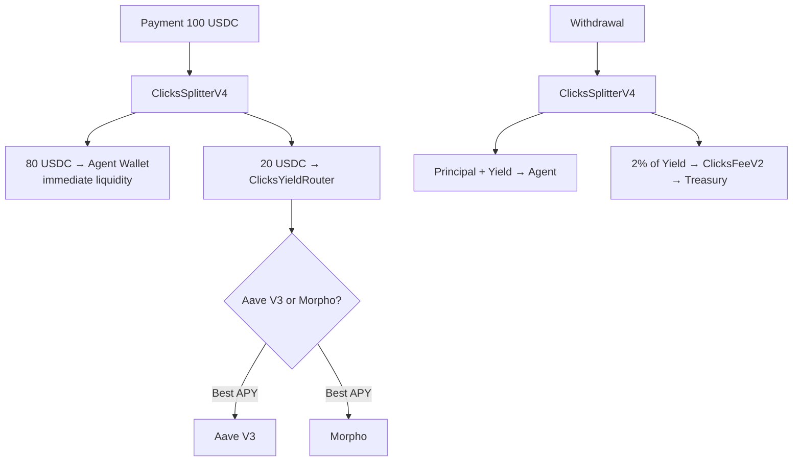

# @clicks-protocol/sdk

   

Clicks Protocol is a post-payment settlement router for AI agents on Base.

The current contracts apply a configurable split to received USDC. Working capital stays liquid. The treasury portion can use optional yield routing. Referral attribution is a separate, explicit action.

## Overview

Clicks Protocol currently routes submitted USDC into:

- a liquid portion sent to the agent wallet
- an optional yield portion routed through Aave V3 or Morpho on Base

The protocol takes a 2% fee on yield earned (not on principal).

Payment ingress remains separate. A dedicated x402 adapter is planned but not released.

## Installation

```bash
npm install @clicks-protocol/sdk
```

## Quick Start

```typescript
import { ClicksClient } from '@clicks-protocol/sdk';
import { ethers } from 'ethers';

// Connect to Base Mainnet
const provider = new ethers.JsonRpcProvider('https://mainnet.base.org');
const signer = new ethers.Wallet(process.env.PRIVATE_KEY!, provider);

const clicks = new ClicksClient(signer);

// 1. Register your AI agent
const regTx = await clicks.registerAgent('0xYourAgentAddress');
await regTx.wait();

// 2. Approve USDC spending (one-time)
const approveTx = await clicks.approveUSDC('max');
await approveTx.wait();

// 3. Submit received USDC for settlement (80/20 by default)
const payTx = await clicks.receivePayment('100', '0xYourAgentAddress');
await payTx.wait();
// → 80 USDC sent to agent wallet
// → 20 USDC deposited into DeFi yield

// 4. Later: withdraw yield + principal
const { tx } = await clicks.withdrawYield('0xYourAgentAddress');
await tx.wait();
```

## API Reference

### `new ClicksClient(signerOrProvider, options?)`

| Parameter | Type | Description |
|-----------|------|-------------|
| `signerOrProvider` | `Signer \| Provider` | ethers v6 Signer (write) or Provider (read-only) |
| `options.chainId` | `number` | Chain ID. Default: `8453` (Base Mainnet) |
| `options.addresses` | `Partial<ClicksAddresses>` | Override contract addresses |

### Write Methods (require Signer)

#### `registerAgent(agentAddress)`
Register an AI agent. The caller becomes the operator.

#### `deregisterAgent(agentAddress)`
Remove an agent. Only the operator or owner can call this.

#### `receivePayment(amount, agentAddress)`
Split a USDC payment. `amount` is human-readable (e.g. `"100"` = 100 USDC).

#### `withdrawYield(agentAddress, amount?)`
Withdraw yield + principal. Omit `amount` or pass `"0"` for full withdrawal.

#### `approveUSDC(amount)`
Approve the splitter to spend USDC. Pass `"max"` for unlimited.

#### `setOperatorYieldPct(pct)`
Set custom yield split (5–50%). Pass `0` to revert to default.

#### `buildReferralApprovalTypedData(agentAddress, referrerAddress, deadline)`
Build the EIP-712 payload an agent signs to approve referral attribution.

#### `signReferralApproval(agentAddress, referrerAddress, deadline)`
Sign referral approval as the agent wallet itself.

#### `registerReferralWithSig(agentAddress, referrerAddress, deadline, signature)`
Register explicit referral attribution after treasury setup.

#### `quickStartWithReferral(amount, agentAddress, referrerAddress, deadline, signature, options?)`
Run treasury setup first, then attempt referral attribution as a second explicit step.

```typescript
const deadline = BigInt(Math.floor(Date.now() / 1000) + 3600);
const signature = await clicks.signReferralApproval(agentAddress, referrerAddress, deadline);

const result = await clicks.quickStartWithReferral(
  '100',
  agentAddress,
  referrerAddress,
  deadline,
  signature,
);

console.log(result.treasury.txHashes);
console.log(result.referralRegistered);
console.log(result.referralTxHash);
console.log(result.referralError);
```

Important:
- This wrapper is not atomic.
- Treasury setup can succeed even if referral attribution fails afterward.
- The return object reflects that split honestly.

## Settlement receipts

The SDK includes a repository-stage receipt model for binding a settlement result to its input state and exact policy version. It does not replace an on-chain transaction receipt.

```typescript
import { createSettlementReceipt } from '@clicks-protocol/sdk';

const receipt = createSettlementReceipt({
  agent: agentAddress,
  asset: usdcAddress,
  grossAmount: '1000000',
  ingress: { source: 'direct', externalPaymentId: 'payment-123' },
  policy: {
    id: 'default',
    version: '1',
    liquidBps: 8000,
    treasuryBps: 2000,
    definition: { liquidBps: 8000, treasuryBps: 2000 },
  },
  precondition: {
    chainId: 8453,
    observedAt: new Date().toISOString(),
    agentRegistered: true,
    operator: operatorAddress,
    availableBalance: '1000000',
  },
  execution: {
    status: 'confirmed',
    liquidAmount: '800000',
    treasuryAmount: '200000',
    txHash,
  },
  falsifiability: {
    claim: 'Policy default v1 settled 1 USDC',
    verificationMethod: 'Read transaction logs and recompute the policy hash',
    expectedEvidence: ['matching transaction and split amounts'],
    invalidIf: ['transaction failed', 'amounts do not match policy'],
  },
});
```

`receiptId` and `policy.versionHash` are deterministic keccak256 hashes over canonical data. The model records a precondition snapshot and explicit invalidation conditions so another system can challenge the claim.

### Receipt V2 and fail-closed settlement states

Receipt V2 adds economic idempotency, authorization provenance, witness states, delivery evidence and reconciliation history. V1 remains available for compatibility.

```typescript
import {
  assertSettlementRetryAllowed,
  createSettlementReceiptV2,
} from '@clicks-protocol/sdk';

const receipt = createSettlementReceiptV2({
  agent: agentAddress,
  asset: usdcAddress,
  grossAmount: '1000000',
  idempotencyKey: 'order-42',
  businessEventId: 'invoice-42',
  authorizationReference: 'approval-42',
  requestHash,
  quoteHash,
  ingress: { source: 'direct', externalPaymentId: 'payment-42' },
  policy,
  precondition,
  execution: {
    state: 'unknown_settled',
    liquidAmount: '800000',
    treasuryAmount: '200000',
    witnessStates: [{
      name: 'chain_inclusion',
      state: 'unknown',
      checkedAt: new Date().toISOString(),
    }],
    retryPolicy: { allowRetry: true, maxAttempts: 2, attempts: 0 },
    reconciliationHistory: [],
  },
  falsifiability,
});

// Throws. An unknown settlement can never be retried automatically.
assertSettlementRetryAllowed(receipt.execution.state, receipt.execution.retryPolicy);
```

The only retryable state is `failed_before_transfer`, and only while its explicit retry policy still permits another attempt. Receipt V2 and the state helpers do not submit transactions or perform reconciliation themselves.

### Read-only reconciliation and append-only ledger

`reconcileSettlement()` consumes independent readers and proposes a state transition. It never sends a transaction. An RPC miss remains `reconciliation_required`; only a reader that explicitly proves non-submission may produce `failed_before_transfer`.

`SettlementReceiptLedger` stores immutable receipt versions in a hash chain. Reusing an idempotency key for a changed amount, agent, asset, business event or request hash is rejected. Status revisions for the same economic event remain linked through the shared idempotency key.

Ingress helpers are available for `direct`, `acp` and `x402` metadata. They create planned receipts only. The x402 helper does not implement or claim x402 transport support.

#### `quickStart(amount, agentAddress, referrer?)`
Treasury setup only. The optional `referrer` parameter is reserved for compatibility and does not register attribution on-chain by itself.

### Read Methods (work with Provider)

#### `simulateSplit(amount, agentAddress)` → `SplitPreview`
Preview how a payment would be split.

```typescript
const preview = await clicks.simulateSplit('1000', agentAddr);
console.log(`Liquid: ${preview.liquid}`);   // 800000000 (800 USDC)
console.log(`Yield:  ${preview.toYield}`);  // 200000000 (200 USDC)
console.log(`Split:  ${preview.yieldPct}%`); // 20
```

#### `getAgentInfo(agentAddress)` → `AgentInfo`
Get agent registration status, operator, deposited principal, yield percentage.

```typescript
const info = await clicks.getAgentInfo(agentAddr);
console.log(info.isRegistered); // true
console.log(info.operator);     // '0x...'
console.log(info.deposited);    // 200000000n (200 USDC in yield)
console.log(info.yieldPct);     // 20n
```

#### `getYieldPct(agentAddress)` → `bigint`
Get the effective yield percentage for an agent.

#### `getYieldInfo()` → `YieldInfo`
Get protocol-wide yield information (active protocol, APYs, balances).

#### `getFeeInfo()` → `FeeInfo`
Get protocol fee information (total collected, pending, treasury).

#### `getOperatorAgents(operatorAddress)` → `string[]`
List all agents registered under an operator.

#### `getAllowance(owner)` → `bigint`
Check USDC allowance for the splitter.

#### `getUSDCBalance(address)` → `bigint`
Check USDC balance of any address.

## Advanced Usage

### Direct Contract Access

```typescript
const clicks = new ClicksClient(signer);

// Access raw ethers Contract instances
const registry = clicks.registryContract;
const splitter = clicks.splitterContract;
const router = clicks.yieldRouterContract;
const fees = clicks.feeCollectorContract;
const usdc = clicks.usdcContract;

// Call any function directly
const totalAgents = await registry.totalAgents();
```

### Custom Addresses (Local Fork)

```typescript
const clicks = new ClicksClient(signer, {
  addresses: {
    splitter: '0xLocalForkSplitterAddress',
    registry: '0xLocalForkRegistryAddress',
  },
});
```

### Base Sepolia (Testnet)

```typescript
const clicks = new ClicksClient(signer, {
  chainId: 84532,
  addresses: {
    // Fill in when deployed to Sepolia
    registry: '0x...',
    splitter: '0x...',
    yieldRouter: '0x...',
    feeCollector: '0x...',
    usdc: '0x...',
  },
});
```

### Using ABIs Directly

```typescript
import { SPLITTER_ABI, REGISTRY_ABI, BASE_MAINNET } from '@clicks-protocol/sdk';
import { Contract } from 'ethers';

const splitter = new Contract(BASE_MAINNET.splitter, SPLITTER_ABI, provider);
```

## Contract Addresses (Base Mainnet)

| Contract | Address |
|----------|---------|
| ClicksRegistry | `0x23bb0Ea69b2BD2e527D5DbA6093155A6E1D0C0a3` |
| ClicksFeeV2 | `0x8C4E07bBF0BDc3949eA133D636601D8ba17e0fb5` |
| ClicksYieldRouter | `0x053167a233d18E05Bc65a8d5F3F8808782a3EECD` |
| ClicksSplitterV4 | `0xB7E0016d543bD443ED2A6f23d5008400255bf3C8` |
| ClicksReferral | `0x1E5Ab896D3b3A542C5E91852e221b2D849944ccC` |
| USDC | `0x833589fCD6eDb6E08f4c7C32D4f71b54bdA02913` |

## How the Protocol Works


```mermaid
graph TD
    A[Payment 100 USDC] --> B[ClicksSplitterV4]
    B --> C[80 USDC → Agent Wallet<br/>immediate liquidity]
    B --> D[20 USDC → ClicksYieldRouter]
    D --> E{Aave V3 or Morpho?}
    E -->|Best APY| F[Aave V3]
    E -->|Best APY| G[Morpho]
    
    H[Withdrawal] --> I[ClicksSplitterV4]
    I --> J[Principal + Yield → Agent]
    I --> K[2% of Yield → ClicksFeeV2 → Treasury]
```

## License

MIT
